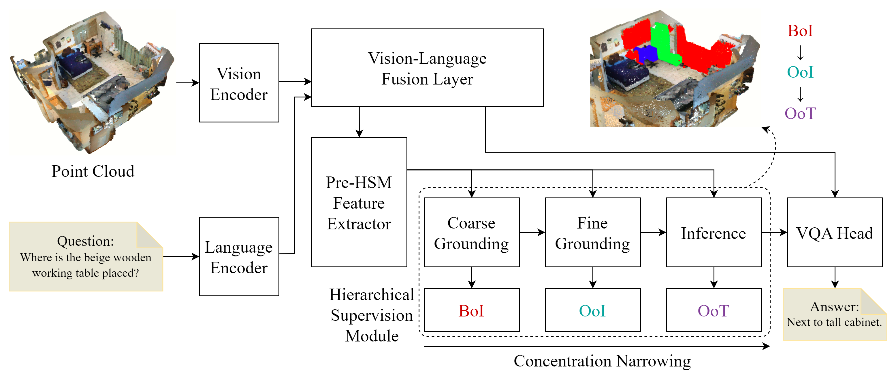

<!--
HCNQA: Enhancing 3D VQA with Hierarchical Concentration Narrowing Supervision  
README – last update: 2025-06-23
-->

<h1 align="center">HCNQA: Enhancing 3D VQA with Hierarchical Concentration Narrowing Supervision</h1>

<p align="center">
  <a href="https://icann2025.org/accepted.html">
    
  </a>
  <a href="https://arxiv.org/abs/2507.01800">
    
  </a>
</p>

<p align="center">
  
</p>

<!--
> **TL;DR** HCNQA introduces a *three-phase Hierarchical Concentration Narrowing (HCN) supervision* strategy for 3D Visual Question Answering.  
> By explicitly supervising **coarse grounding → fine grounding → inference**, our model suppresses shortcut cues and achieves **+1.1 EM@1** and **+2.3 CIDEr** on ScanQA (*test w/ obj*) versus the previous state-of-the-art.
-->

> **TL;DR** HCNQA improves 3D Visual Question-Answering by hierarchically supervising reasoning phases (BoI, OoI, OoT) to suppress shortcuts, achieving better accuracy and robustness.

## Installation

```bash
conda create -n hcnqa python=3.9 -y
conda activate hcnqa
pip install -r requirements.txt
cd model/vision/pointnet2
pip install .
```

## Data Preparation
1. Please refer to the tutorial of [3D-VisTA](https://github.com/3d-vista/3D-VisTA?tab=readme-ov-file), download and extract the ScanQA dataset.
2. download the annotation of our work from [coarse_ground_train_5.json](https://huggingface.co/JianuoZ/HCNQA/blob/main/coarse_ground_train_5.json) and [coarse_ground_val_5.json](https://huggingface.co/JianuoZ/HCNQA/blob/main/coarse_ground_val_5.json).

## Checkpoints

1. Download the checkpoint for the language encoder (bert-base-uncased).
2. Download the checkpoint for our model from [eqa_235_5x5_ft5_2389.pth](https://huggingface.co/JianuoZ/HCNQA/blob/main/eqa_235_5x5_ft5_2389.pth).

## Training

```bash
python run.py --config project/vista/scanqa_train.yml
```

## Evaluation

```bash
python run.py --config project/vista/scanqa_eval.yml
```

## License & Acknowledgements

This repository is released under the MIT License (see LICENSE).

The whole codebase inherits heavily from the open-sourced <a href="https://github.com/3d-vista/3D-VisTA">3D-VisTA</a> project.

We gratefully acknowledge their clean design and utilities.

## Citation

If you find this project useful in your research, please consider citing:

```bib
@misc{zhou2025hcnqaenhancing3dvqa,
      title={HCNQA: Enhancing 3D VQA with Hierarchical Concentration Narrowing Supervision}, 
      author={Shengli Zhou and Jianuo Zhu and Qilin Huang and Fangjing Wang and Yanfu Zhang and Feng Zheng},
      year={2025},
      eprint={2507.01800},
      archivePrefix={arXiv},
      primaryClass={cs.CV},
      url={https://arxiv.org/abs/2507.01800}, 
}
```
